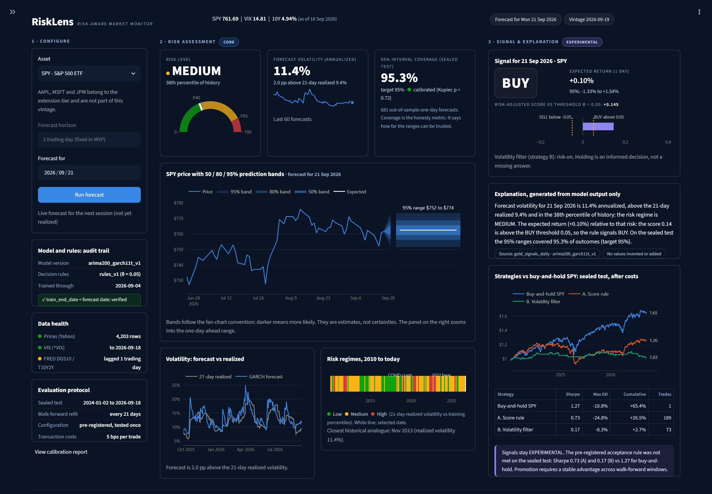

# Risk-Aware Stock Forecasting and Trading Decision Support System

**Máster en Data Science — Trabajo de Fin de Máster**

A risk-first financial decision support system: its core is rigorous **volatility forecasting and risk explanation** (GARCH, calibrated prediction intervals), complemented by an **experimental return-forecasting and trading-signal layer** (ARIMA + rule-based BUY/SELL/HOLD) that is promoted to "recommendation" status only if it proves consistent out-of-sample value in cost-adjusted, walk-forward backtesting. The system is implemented end to end for four assets (SPY, AAPL, MSFT, JPM): data pipeline, models, backtest and the **RiskLens** dashboard.

> ⚠️ **Disclaimer:** This is an academic project. Its outputs are probabilistic decision-support prototypes, **not financial advice**. Backtested performance does not guarantee future results.

## Results (sealed test, 2024-01-02 to 2026-09-18, pre-registered and run once per asset)

SPY was pre-registered first (tag `preregistered-v1`); AAPL, MSFT and JPM followed the same protocol, pre-registered together (tag `preregistered-v2`) before their test windows were opened. Each asset uses its own models and thresholds, and its own buy-and-hold as the primary baseline.

| Asset | GARCH-t vs rolling volatility (QLIKE, DM p) | 95% coverage: GARCH-t / rolling (Kupiec p) | ARIMA vs naive return forecast (p) | Sharpe: buy-and-hold / score rule / vol filter |
|---|---|---|---|---|
| SPY | -8.50 vs -8.36 (0.010) | 95.2% (0.85) / 93.0% (0.021) | no better (0.54) | 1.27 / 0.73 / 0.17 |
| AAPL | -7.21 vs -7.06 (0.008) | 94.1% (0.31) / 91.9% (0.001) | no better (0.61) | 0.90 / 0.95* / 0.07 |
| MSFT | -7.23 vs -7.08 (0.003) | 94.6% (0.61) / 92.1% (0.001) | worse (0.048) | 0.54 / 0.35 / 0.18 |
| JPM | -7.39 vs -7.28 (0.002) | 94.9% (0.87) / 93.0% (0.021) | no better (0.56) | 1.33 / 1.01 / 0.70 |

\* AAPL's score rule technically meets the acceptance rule, but it made a single trade (its mean model is a constant), so it behaves as buy-and-hold: not evidence of timing skill.

- **Risk (core): validated on all four assets.** GARCH(1,1)-t beats the 21-day rolling baseline on QLIKE for every asset, its 95% intervals are calibrated (Kupiec p > 0.3), and the rolling baseline's intervals are rejected for every asset.
- **Returns and signals: no validated edge.** ARIMA never forecasts better than zero (significantly worse for MSFT), and no strategy beats buy-and-hold of the same asset in a way that counts as skill. Signals stay labeled EXPERIMENTAL.

Details: [`reports/test_results.md`](reports/test_results.md) (SPY) and `reports/test_results_<TICKER>.md`, [`reports/model_findings.md`](reports/model_findings.md), and [`docs/IMPLEMENTATION_NOTES.md`](docs/IMPLEMENTATION_NOTES.md) (how the implementation follows the instructor feedback and where it refines the design).

## RiskLens dashboard

Single-screen Streamlit dashboard with a risk-first hierarchy: **1 · Configure** (asset, date, audit trail of model and rule versions, data health) → **2 · Risk assessment, core** (risk gauge with historical percentile, forecast vs realized volatility, fan chart with 50/80/95% prediction bands, risk-regime timeline 2010 to today, calibration health) → **3 · Signal & explanation, experimental** (BUY/SELL/HOLD with its threshold margin, explanation generated only from displayed numbers, equity curves vs buy-and-hold after costs).



**Live app: https://risklensspy.streamlit.app/**. Or run it locally with `uv run streamlit run app/streamlit_app.py`.

**Presentation:** [thesis defense deck (PDF, 12 slides)](docs/presentation/RiskLens_thesis_defense.pdf). The design mockup from Deliverable 5 is in [`docs/assets/05_mockup_frontal.png`](docs/assets/05_mockup_frontal.png); its numbers are illustrative, the screenshot above shows real model output.

## Project structure

```
.
|-- docs/
|   |-- entregas/                     # Deliverables 1-5 (design documents, unchanged)
|   |-- IMPLEMENTATION_NOTES.md       # Feedback compliance and design-vs-implementation notes
|   |-- PROJECT_CHECKLIST.md          # Work plan and status
|   |-- presentation/                 # Thesis defense deck (PDF)
|   `-- assets/                       # Deliverable 5 mockup and dashboard screenshot
|-- src/risklens/                     # Pipeline, models, backtest, dashboard data and charts, live layer
|-- app/                              # Streamlit dashboard (streamlit_app.py + calibration page)
|-- tests/                            # Automated tests (pipeline, models, dashboard, live layer)
|-- .github/workflows/live-refresh.yml   # Daily live-data refresh (weekdays, after the US close)
|-- config/preregistered.json         # SPY: frozen models, thresholds and protocol (tag preregistered-v1)
|-- config/preregistered_extension.json  # AAPL, MSFT, JPM (tag preregistered-v2)
|-- data/
|   |-- raw/                          # Immutable source snapshots + VINTAGE.json (tag vintage-2026-09-19)
|   |-- processed/                    # Cleaned, standardized tables (CSV)
|   |-- gold/                         # gold_market_daily and gold_signals_daily (Parquet), frozen
|   `-- live/                         # Post-freeze data, signals, monitor and data_status.json (auto-updated)
|-- reports/                          # EDA, validation, calibration and sealed-test results, figures
|-- pyproject.toml, uv.lock           # Locked environment (uv, Python 3.12)
`-- requirements.txt                  # For Streamlit Community Cloud
```

## Deliverables and implementation

Deliverables 2–4 were revised to incorporate instructor feedback (25 Jul); each carries a revision note describing the changes for traceability.

| # | Document | Status |
|---|---|---|
| 1 | [Product ideas](docs/entregas/01_ideas_producto.md) | ✅ Delivered |
| 2 | [Selected idea & data requirements](docs/entregas/02_datos_necesarios.md) | ✅ Delivered · revised per feedback |
| 3 | [Data model & gold layer](docs/entregas/03_modelo_datos.md) | ✅ Delivered · revised per feedback |
| 4 | [Analysis design & modeling strategy](docs/entregas/04_analisis_modelado.md) | ✅ Delivered · revised per feedback |
| 5 | [Frontend design & UX](docs/entregas/05_diseno_frontal.md) | ✅ Delivered |
| — | Implementation: pipeline, models, backtest, dashboard, tests | ✅ Done · see [implementation notes](docs/IMPLEMENTATION_NOTES.md) |

## MVP scope (risk-first)

| Tier | Content | Outcome |
|---|---|---|
| **Core (must have)** | Validated risk system for SPY: GARCH volatility forecasts, low/medium/high risk levels, calibrated prediction intervals, risk explanation layer | ✅ Implemented and validated on the sealed test |
| **Conditional** | Return forecasts + BUY/SELL/HOLD signals, shown as recommendations only if they beat per-asset buy-and-hold out-of-sample after costs; otherwise labeled *experimental information* | Implemented; acceptance rule not met, so signals stay labeled experimental |
| **Nice to have** | Extension to AAPL, MSFT, JPM; full interactive calibration-report page | ✅ Both done: three more assets under the same pre-registered protocol, and a calibration report page |

## Data architecture (Deliverable 3)

Three-layer flat-file design — **CSV** for `raw/` and `processed/` (transparent, auditable), **Parquet** for `gold/` (typed schema, consumed by code). No database: ~35k rows total makes one unjustifiable.

The gold layer is a two-dataset **data contract**:

| Gold dataset | Granularity | Role |
|---|---|---|
| `gold_market_daily.parquet` | One row per (date, ticker) · 16,728 rows | **Model input** — adjusted prices, log returns (target), lags, rolling volatility, VIX & Treasury regressors |
| `gold_signals_daily.parquet` | One row per (forecast date, ticker) · 4,732 rows (4 assets) | **Model output** — forecasts, 50/80/95% prediction intervals, risk level, signal, plus full audit trail: `model_version`, `train_end_date` (asserted `< date`: machine-checked no-look-ahead proof), `horizon_days`, `rule_version`. `date` is the forecast target day; `origin_date` is the day whose information was used |

Every decision row is reproducible: model and rule versions map to repository tags, so any historical signal can be re-generated exactly.

## Modeling strategy (Deliverable 4) and what was implemented

Two coupled forecasting tasks + a transparent decision rule, always measured against demanding baselines:

| Task | Baseline | Implemented model | Primary metrics |
|---|---|---|---|
| Next-day return (mean) | Naive zero-return (random walk) | ARIMA with the order chosen by BIC on each asset's training data (SPY: (2,0,0)); ARIMAX with VIX/yield changes was tested on SPY and not selected | RMSE/MAE vs. naive, directional accuracy |
| Next-day volatility (risk) | 21-day rolling volatility (and EWMA) | GARCH(1,1) with Student-t errors; GJR-GARCH tested as the asymmetric variant | QLIKE, 95% prediction-interval coverage |
| Trading strategy | **Buy-and-hold of the same asset** (primary) · buy-and-hold SPY (market reference) | Score rule `expected_return / volatility` → BUY/SELL/HOLD and a volatility filter, both calibrated on validation only | Sharpe, max drawdown, hit ratio — after transaction costs |

**Validation guarantees:**
- Temporal split: train 2010–2021 · validation 2022–2023 · test 2024 → frozen end date (2026-09-18), with walk-forward re-fitting every 21 trading days
- **Sealed test protocol:** test period and raw-data vintage frozen before modeling; winning models and thresholds pre-registered (repository tag `preregistered-v1`) before the test was opened; test evaluated exactly once by a runner that refuses to execute if the frozen files changed
- **t+1 execution convention:** a signal computed after the close of day *t* is executed at *t+1*. The primary backtest executes at the close of *t+1* (earning the return of *t+2*); the shift-one-day variant is reported as a sensitivity, and conclusions are the same under both
- Strict leakage controls: lag-only features, train-only statistics, forward-fill-only alignment, FRED yields lagged one trading day

## Live data layer (after the freeze)

The frozen vintage and the sealed test never change. On top of them, a daily job keeps the dashboard current:

| Step | What happens |
|---|---|
| Fetch | Prices from Yahoo, then Tiingo (free key, `TIINGO_API_KEY`) if Yahoo fails; VIX from Yahoo, then FRED; DGS10/T10Y2Y from FRED. Retries with backoff. |
| Validate | Only completed sessions; returns must match the stored history on the overlap; no absurd moves; all four assets share one calendar. Anything that fails is rejected. |
| Fall back | If every source fails, the last good data stays and `data/live/data_status.json` says `fallback`. `current` and `delayed` (source not yet published) are the other states. |
| Score | New signals use the pre-registered procedure (walk-forward refit every 21 days, frozen thresholds). Models are scored, not retrained; the forecast for the last frozen origin is reproduced exactly. |
| Monitor | Live coverage, QLIKE vs the rolling baseline and a `watch` flag, in `reports/live_monitoring.md` (needs 20 realized forecasts before it judges). |

Post-freeze rows are labelled `post_freeze` (realized) and `live` (next session) and are never mixed into the sealed-test metrics. The graded EDA and thresholds are untouched. Run it by hand with `uv run python -m risklens.live_pipeline`; the GitHub Action does the same and commits `data/live/` and `reports/live_monitoring.md`.

## Data sources (all open & free)

- **Yahoo Finance** (`yfinance`) — daily OHLCV for SPY, AAPL, MSFT, JPM; VIX
- **FRED** — 10Y Treasury yield (DGS10), yield spread (T10Y2Y), CPI (CPIAUCSL)

Raw downloads are committed to the repository as an immutable, dated vintage — the project never depends on live source availability (`yfinance` uses unofficial access that may change).

*Attribution and terms:* prices and VIX come from Yahoo Finance (via `yfinance`), yields and CPI from FRED (Federal Reserve Bank of St. Louis). The raw files are included only to make this academic project reproducible; check each source's terms of use before any other reuse.

## Tech stack

Python 3.12 · uv · pandas · statsmodels (ARIMA) · arch (GARCH) · Plotly · Streamlit · ruff · pytest · CSV/Parquet layered data storage

## Run it

```
uv sync
uv run python -m risklens.clean && uv run python -m risklens.build_gold   # from the frozen raw vintage
uv run python -m risklens.eda
uv run python -m risklens.data_quality && uv run python -m risklens.diagnostics
uv run python -m risklens.run_validation && uv run python -m risklens.calibrate
uv run python -m risklens.run_test      # SPY: needs tag preregistered-v1 and unchanged frozen files
uv run python -m risklens.extension     # AAPL, MSFT, JPM: validation and calibration (validation data only)
uv run python -m risklens.run_test --extension   # their sealed test: needs tag preregistered-v2
uv run python -m risklens.live_pipeline   # refresh live data, signals and monitoring
uv run streamlit run app/streamlit_app.py
uv run pytest
```

`risklens.ingest` re-downloads data and refuses to overwrite the frozen vintage without `--force`.
