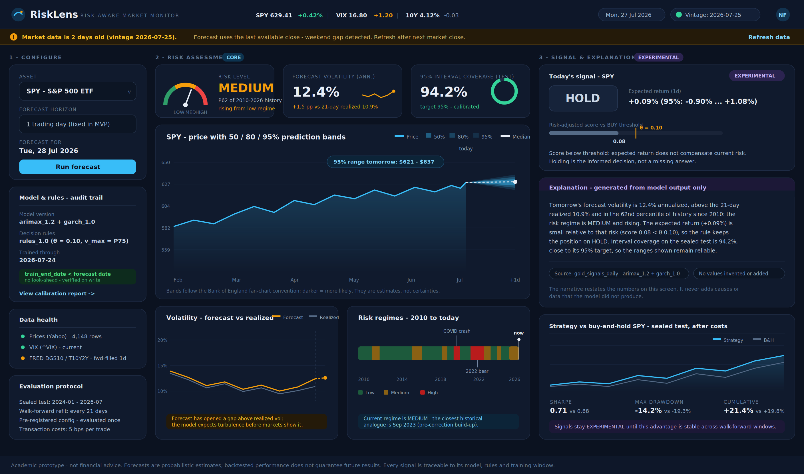

# Deliverable 5 — Frontend Design and User Experience

**Project:** Risk-Aware Stock Forecasting and Trading Decision Support System
**Máster en Data Science — Trabajo de Fin de Máster**

---

## 1. Solution and User Summary

**Problem.** Retail investors decide whether to buy, sell, or hold without any quantitative view of the *risk* surrounding a position. Free tools show prices and point predictions; uncertainty is invisible, and decisions end up driven by emotion and bad timing.

**Primary user.** A non-professional investor with basic financial literacy (understands "volatility" informally, does not read econometrics). They check the market briefly — minutes, not hours — before deciding on one asset.

**Concrete task/decision.** Each day, for a chosen asset: *"How risky is the market right now, what range of movement should I realistically expect tomorrow, and does the system see any reason to act — or is holding the informed choice?"*

**Product type.** A **risk monitor and decision-support dashboard** (single screen), implemented in Streamlit. It is *not* a trading terminal: it supports one recurring decision with context, not order execution.

**Main result/action.** The user obtains (a) a validated risk assessment — volatility forecast, risk level, and a calibrated 95% range for tomorrow's price — and (b) a rule-based BUY/SELL/HOLD signal presented as **experimental information** unless it has proven consistent out-of-sample value. The action is a better-informed hold/act decision, taken outside the tool, with the standing disclaimer that this is an academic prototype and not financial advice.

## 2. Frontend Mockup

Main screen of **RiskLens** (horizontal, desktop-first, dark theme). The dark palette is a deliberate, researched choice, not a style preference: dark interfaces are the de-facto standard for data-dense financial monitoring because they maximize contrast for chart colors and status semantics during extended sessions, and they are designed as such from the start rather than by inverting a light theme (status colors are chosen for WCAG contrast on the dark background, and risk states are always double-encoded with text and position, never color alone). The layout is a three-zone workflow, numbered because it encodes the real usage sequence:

| Zone | Content shown in the mockup |
|---|---|
| **1 · Configure** (left) | Asset selector (SPY), fixed 1-day horizon (shown for transparency), forecast date, "Run forecast" action. Below: the **audit trail card** (model version, rule version with the threshold values, training cut-off with the verified "no look-ahead" check), a **data-health card** (per-source status: prices, VIX, FRED alignment), and the **evaluation protocol card** (sealed test window, walk-forward refit, transaction costs). |
| **2 · Risk assessment — CORE** (center) | The hero is a **risk gauge** (low/medium/high needle with the historical percentile) — following the fintech "lead with one number" trust pattern; beside it, forecast volatility vs its realized baseline and the 95% interval coverage — the calibration "honesty metric". Main chart: a **Bank-of-England-style fan chart** — price history with three nested prediction bands (50/80/95%, darker = more likely) opening after the "today" divider, with the 95% range annotated in dollars. Below: GARCH forecast-vs-realized volatility, and a **risk-regime timeline (2010–today)** that places the current regime in 16 years of history, with its closest historical analogue named. |
| **3 · Signal & explanation — EXPERIMENTAL** (right) | The HOLD signal in a deliberately neutral card with an **EXPERIMENTAL badge**, the risk-adjusted score plotted against the BUY threshold θ, the expected return with its interval, a **grounded generated explanation** (with source chips proving traceability), and the backtest equity curves against buy-and-hold of the same asset, after costs. |
| **System states** | A stale-data banner (amber, top) demonstrates the exception design: vintage date, cause, consequence, and remedial action. The footer carries the permanent academic disclaimer. |

## 3. Design Justification

### 3.1 Utility and value

- **Task solved.** The frontal turns three model outputs (expected return, forecast volatility, calibrated interval) into one answerable daily question: *act or hold, and with how much confidence.* It reduces the risk the project targets — decisions blind to volatility — by making risk the largest, first-read element of the screen.
- **Decision improved / risk reduced.** The interval chart replaces the false certainty of a point prediction with an honest range; the risk level contextualizes "is now unusual?" via the historical percentile; the backtest panel answers "would following this have been better than doing nothing?" — the exact comparison a user cannot do alone.
- **Essential vs. hidden information.** Essential and visible: risk level, volatility vs its baseline, tomorrow's range, calibration health, signal + its status, and the audit trail (which builds trust). Deliberately *not* shown on the main screen: model coefficients, residual diagnostics, ACF plots, walk-forward tables, grid-search surfaces — all reachable via "View calibration report" but excluded from the primary view because they serve the analyst (and the course defense), not the daily decision.
- **From analytics to action.** The rule layer (score vs θ) is displayed graphically rather than hidden: the user *sees why* the answer is HOLD (score 0.08 below threshold 0.10). The design principle, stated on the card itself: **holding is an informed decision, not a missing answer** — which is precisely the value of a risk-first product.

### 3.2 User flow

1. **Entry.** The user lands on the configured default (SPY). The first read, by visual weight, is the risk zone: risk level MEDIUM, volatility 12.4% and rising. The header shows date and data vintage, so freshness is known before anything is interpreted.
2. **Inputs.** Minimal by design: choose asset, confirm date, press "Run forecast". The horizon is fixed (1 day) and shown as read-only — transparency about scope instead of a fake option.
3. **Processing (invisible but declared).** The pre-registered ARIMAX + GARCH configuration produces the forecast from `gold_market_daily`; the frozen rule set converts it into a signal; everything is written to `gold_signals_daily` with its audit fields. The UI declares *which* versions ran (audit card) without exposing how.
4. **Result.** Risk KPIs, the interval cone, and the signal card. Trust is supported three ways: the coverage KPI (94.2% vs 95% target) says the intervals can be believed; the audit card says the output is reproducible; the backtest says what following the signals historically produced. "Deepening" is one click: the calibration report link.
5. **Action.** The user holds or acts outside the tool. Secondary actions: switch asset, refresh data, open the detailed report.
6. **Exceptions (designed, not accidental).**
   - *Stale data* → the amber banner shown in the mockup: names the vintage, the cause (weekend gap), the consequence (forecast uses last close), and the fix (refresh).
   - *High uncertainty / weak signal* → not an error state: the system returns HOLD with the explanation that uncertainty dominates — the mockup shows exactly this state on purpose.
   - *Signals not validated* → the EXPERIMENTAL badge is permanent until the pre-registered test criterion is met; the backtest card states the promotion condition.
   - *Pipeline/data failure* → the result zones render an explicit empty state ("No forecast for this date — data validation failed at ingestion; see log") rather than stale numbers; the banner pattern is reused in red.

### 3.3 User experience

- **Visual hierarchy.** Reading order is engineered: (1) the risk gauge — one large, immediately legible answer to "how risky is now?", applying the fintech trust pattern of leading with a single number rather than a wall of data; (2) the fan chart — the graphical core, using the Bank of England's fan-chart convention (nested 50/80/95% bands, darker = more likely) precisely because it is the canonical way to communicate *what is not known*; (3) only then the signal, placed last and styled neutrally. A conventional trading UI would lead with a green BUY; inverting that hierarchy is the design's central, deliberate choice, and it follows directly from the instructor's guidance that risk estimation is the defensible core of this product. Every headline value also follows the three-layer context pattern: live value (foreground) + comparison baseline (midground) + historical range/percentile (background), so no number ever appears without its "is this normal?" context.
- **Simplicity.** One screen, one asset at a time, three zones, no tabs for the MVP. Every metric shown has a job; everything else lives behind the report link. The signal is one word, not a dashboard of its own.
- **Legibility and consistency.** One semantic color system: **amber = elevated risk/warnings**, **green = validated/healthy** (calibration, no-look-ahead check), **purple = experimental**, **navy/blue = data and primary actions**. Red is reserved for genuine SELL signals and hard errors, so it retains meaning. Money in $, volatility in annualized %, returns in % with their interval — units always attached. Buttons say what they do ("Run forecast", "Refresh data").
- **Context and trust.** Nothing is shown as a naked number: volatility comes with its realized baseline and historical percentile; the prediction comes as a range with its coverage health; the signal comes with its threshold and its backtested consequences vs doing nothing; every output carries its model/rule version. The chart footnote states in plain words that the shaded area is an estimate.
- **User control.** The user can change asset and date, re-run, refresh data, open the detail report — and, crucially, is never pushed to follow the signal: the explanation and the "informed HOLD" framing keep the human as the decision-maker who can accept or ignore the recommendation.
- **System feedback.** Run button → spinner + "Fitting pre-registered model…" status; completed state shows the run timestamp; banners for stale data (amber) and failures (red) follow one consistent pattern: what happened → consequence → action.
- **Accessibility/device.** Desktop-first (deliberate: a monitoring task, and Streamlit's natural layout), with a color palette chosen to survive common color-vision deficiencies because risk states are always double-encoded (color + text label + position on the low/medium/high scale).

## 4. Result Presentation and Explainability

- **Main result.** A composite, presented in fixed order of reliability: (1) risk level + volatility forecast (validated core), (2) calibrated 95% price range for tomorrow, (3) BUY/SELL/HOLD signal (experimental layer).
- **Interpretation aids.** Comparison (forecast vs 21-day realized; strategy vs buy-and-hold of the same asset), history (percentile since 2010; six months of price context), uncertainty (the interval cone and the ± on expected return), quality (coverage KPI), and limitations (footnote + permanent disclaimer).
- **Avoiding false certainty.** No point prediction is ever shown without its interval; the chart footnote labels the band as an estimate; coverage is displayed as a first-class KPI so the user can see when calibration degrades; the signal card shows the *margin* by which the threshold was or wasn't crossed instead of a bare label; and the EXPERIMENTAL badge prevents the strongest element (a trading signal) from borrowing credibility it hasn't earned.
- **Main screen vs. detail view.** Main screen: decisions and their context (everything in the mockup). Detail view ("View calibration report", implemented as a second Streamlit page if time allows, otherwise a static report): interval coverage over time, walk-forward stability, per-regime errors, GARCH parameters, threshold sensitivity surface, and residual diagnostics — the defense-grade evidence.

**Generative AI as an explanation layer — used, with strict grounding.** The "Explanation" card is produced by a template-first narrative generator over the current row of `gold_signals_daily` (plus its displayed context values): it restates volatility vs baseline, the percentile, the score-vs-threshold comparison, and the calibration status in plain language. Rules: it may only reference values visible on the screen; it never proposes causes, external events, or data the model did not produce; and the card displays its source chips ("Source: gold_signals_daily · model arimax_1.2 + garch_1.0" / "No values invented or added") so traceability is part of the UI itself. An LLM may be used to smooth the template's wording, but with the same hard constraint — grounded restatement, not generation of new claims. If this guarantee cannot be met robustly, the MVP ships the deterministic template version, which already fulfils the explanatory function.

## 5. MVP Scope

**Actually implemented and functional at course end (Streamlit):**
- Asset selector (SPY default; AAPL/MSFT/JPM if the nice-to-have tier is reached), forecast run, and data-vintage display
- The full risk core: risk gauge with historical percentile, volatility KPIs, the fan chart with 50/80/95% prediction bands, forecast-vs-realized volatility chart, the risk-regime timeline (computed from rolling-volatility percentiles), and the coverage KPI — all fed live from `gold_market_daily` / `gold_signals_daily`
- The signal card with score-vs-threshold display and its EXPERIMENTAL/validated status logic
- The grounded explanation card (deterministic template; LLM wording pass only if the grounding constraint is robust)
- The backtest comparison table vs buy-and-hold, after costs
- Stale-data banner and empty/error states

**Visual representation only (in the mockup, not committed for the MVP):**
- The "Refresh data" live re-download button (the MVP works from the frozen vintage; refresh is a documented manual pipeline step)
- The user avatar/account area (no authentication in an academic prototype)
- The full interactive calibration report page (delivered as a static report if time runs short)

**Technology.** Streamlit (UI) · Plotly (interval and volatility charts) · pandas + Parquet gold layer as the only data interface · deployment target: Streamlit Community Cloud from the public GitHub repository.

The design is intentionally ambitious in usefulness — a complete risk-first decision aid — but every implemented element consumes only the two gold datasets already contracted in Deliverable 3, which is what makes the scope realistic.

---

*This document corresponds to Deliverable 5. Deliverables 1–4 are maintained unchanged in this same directory for traceability. The mockup image is stored at `docs/assets/05_mockup_frontal.png` and embedded above via a relative path.*
